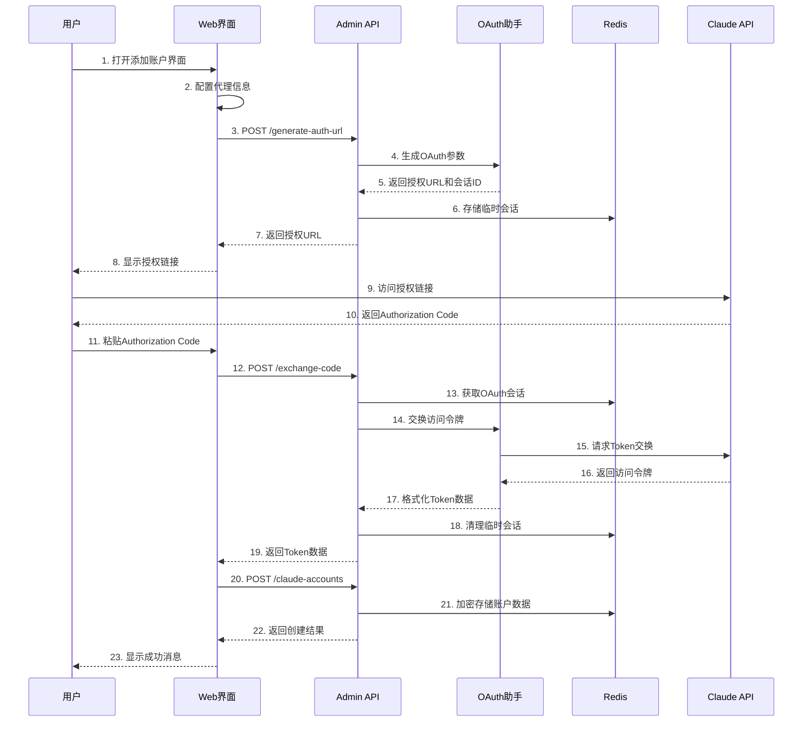

# Claude 账号管理完整学习指南

## 📖 概述

本文档详细介绍了 Claude Relay Service 项目中 Claude Code 账号管理的完整实现，特别是从 Web 端进行账号验证的流程。通过学习本指南，您将掌握现代 Web 应用中 OAuth 2.0 + PKCE 认证的最佳实践。

## 🏗️ 整体架构

### 1. 三层架构设计

```
┌─────────────────────────────────────────────────────────────────┐
│                    Web 管理界面                                   │
│  ┌─────────────┐  ┌─────────────┐  ┌─────────────┐            │
│  │  Vue.js 前端 │  │  管理员认证  │  │  OAuth 流程  │            │
│  │  (app.js)   │  │  (JWT)      │  │  (PKCE)     │            │
│  └─────────────┘  └─────────────┘  └─────────────┘            │
└─────────────────────────────────────────────────────────────────┘
                              │
                              ▼
┌─────────────────────────────────────────────────────────────────┐
│                    Express 后端 API                             │
│  ┌─────────────┐  ┌─────────────┐  ┌─────────────┐            │
│  │ Web 路由     │  │ Admin 路由   │  │ OAuth 助手   │            │
│  │ (auth/login) │  │ (accounts)  │  │ (PKCE)      │            │
│  └─────────────┘  └─────────────┘  └─────────────┘            │
└─────────────────────────────────────────────────────────────────┘
                              │
                              ▼
┌─────────────────────────────────────────────────────────────────┐
│                    数据存储层                                    │
│  ┌─────────────┐  ┌─────────────┐  ┌─────────────┐            │
│  │  Redis      │  │  文件系统    │  │  加密存储    │            │
│  │ (会话/缓存)  │  │ (init.json) │  │ (AES-256)   │            │
│  └─────────────┘  └─────────────┘  └─────────────┘            │
└─────────────────────────────────────────────────────────────────┘
```

### 2. 核心组件

- **前端界面**：Vue.js 3 + Tailwind CSS + Font Awesome
- **后端API**：Express.js + Redis + 加密存储
- **认证系统**：JWT 管理员认证 + OAuth 2.0 PKCE
- **数据存储**：Redis 缓存 + 文件系统配置

## 🌐 客户端网络转发流程详解

### 1. 完整的请求转发架构

```
┌─────────────────┐    ┌─────────────────┐    ┌─────────────────┐
│   客户端应用     │    │  Claude Relay   │    │   Anthropic     │
│  (SillyTavern)  │    │    Service      │    │   Claude API    │
└─────────────────┘    └─────────────────┘    └─────────────────┘
         │                       │                       │
         │ 1. POST /api/v1/      │                       │
         │    messages           │                       │
         │ ✅ x-api-key: cr_xxx  │                       │
         ├─────────────────────→ │                       │
         │                       │ 2. API Key 验证        │
         │                       │ ✅ authenticateApiKey │
         │                       │                       │
         │                       │ 3. 选择 Claude 账户    │
         │                       │ ✅ selectAccount      │
         │                       │                       │
         │                       │ 4. Token 检查/刷新     │
         │                       │ ✅ getValidAccessToken│
         │                       │                       │
         │                       │ 5. 代理配置 & 转发      │
         │                       │ ✅ Bearer: oauth_token │
         │                       ├─────────────────────→ │
         │                       │                       │ 6. Claude 处理
         │                       │ ◀─────────────────────┤ ✅ SSE Stream
         │ ◀─────────────────────┤ 7. 转发响应 & 统计     │
         │ ✅ 流式/非流式响应      │ ✅ Usage Recording    │
```

### 2. API 端点和认证机制

#### 2.1 主要客户端端点 (src/routes/api.js)

**核心消息端点**：
```javascript
POST /api/v1/messages
Headers: {
    "x-api-key": "cr_xxxxxxxxxxxx",  // 自建API Key
    "content-type": "application/json"
}
Body: {
    "model": "claude-3-5-sonnet-20241022",
    "max_tokens": 4000,
    "messages": [
        {
            "role": "user", 
            "content": "Hello"
        }
    ],
    "stream": true  // 可选：启用流式响应
}
```

**兼容性端点**：
```javascript
GET /api/v1/models      # 模型列表
GET /api/v1/usage       # 使用统计
GET /api/v1/key-info    # API Key 信息
```

#### 2.2 API Key 认证流程 (src/middleware/auth.js:7-135)

```javascript
const authenticateApiKey = async (req, res, next) => {
    // 1. 提取 API Key (支持多种格式)
    const apiKey = req.headers['x-api-key'] || 
                   req.headers['authorization']?.replace(/^Bearer\s+/i, '') ||
                   req.headers['api-key'];
    
    // 2. 格式验证 (cr_ 前缀)
    if (!apiKey?.startsWith('cr_')) {
        return res.status(401).json({
            error: 'Invalid API key format'
        });
    }

    // 3. 哈希计算并查找 (O(1) 性能优化)
    const hashedKey = crypto.createHash('sha256')
        .update(apiKey + config.security.encryptionKey)
        .digest('hex');
    
    const keyData = await redis.findApiKeyByHash(hashedKey);
    
    // 4. 权限和限制检查
    if (!keyData?.isActive || keyData.expiresAt < Date.now()) {
        return res.status(401).json({
            error: 'API key expired or disabled'
        });
    }

    // 5. 并发限制控制
    const concurrencyLimit = keyData.concurrencyLimit || 0;
    if (concurrencyLimit > 0) {
        const currentConcurrency = await redis.incrConcurrency(keyData.id);
        if (currentConcurrency > concurrencyLimit) {
            await redis.decrConcurrency(keyData.id);
            return res.status(429).json({
                error: 'Concurrency limit exceeded',
                currentConcurrency: currentConcurrency - 1,
                concurrencyLimit
            });
        }
        
        // 设置清理监听器
        res.once('close', () => redis.decrConcurrency(keyData.id));
        res.once('finish', () => redis.decrConcurrency(keyData.id));
    }

    // 6. 传递验证信息
    req.apiKey = {
        id: keyData.id,
        name: keyData.name,
        tokenLimit: keyData.tokenLimit,
        claudeAccountId: keyData.claudeAccountId
    };
    
    next();
};
```

### 3. 核心转发服务实现

#### 3.1 消息处理端点 (src/routes/api.js:10-185)

```javascript
router.post('/v1/messages', authenticateApiKey, async (req, res) => {
    try {
        // 1. 输入验证
        if (!req.body?.messages?.length) {
            return res.status(400).json({
                error: 'Invalid request',
                message: 'Messages array cannot be empty'
            });
        }

        const isStream = req.body.stream === true;
        
        if (isStream) {
            // 2A. 流式响应处理
            res.setHeader('Content-Type', 'text/event-stream');
            res.setHeader('Cache-Control', 'no-cache');
            res.setHeader('Connection', 'keep-alive');
            
            let usageDataCaptured = false;
            
            await claudeRelayService.relayStreamRequestWithUsageCapture(
                req.body, req.apiKey, res, req.headers, 
                (usageData) => {
                    // Usage 回调：记录真实token使用量
                    if (usageData?.input_tokens !== undefined && 
                        usageData?.output_tokens !== undefined) {
                        
                        apiKeyService.recordUsage(
                            req.apiKey.id,
                            usageData.input_tokens || 0,
                            usageData.output_tokens || 0,
                            usageData.cache_creation_input_tokens || 0,
                            usageData.cache_read_input_tokens || 0,
                            usageData.model || 'unknown'
                        );
                        
                        usageDataCaptured = true;
                    }
                }
            );
        } else {
            // 2B. 非流式响应处理
            const response = await claudeRelayService.relayRequest(
                req.body, req.apiKey, req, res, req.headers
            );
            
            res.status(response.statusCode);
            
            // 设置响应头 (排除 content-encoding)
            Object.keys(response.headers).forEach(key => {
                if (key.toLowerCase() !== 'content-encoding') {
                    res.setHeader(key, response.headers[key]);
                }
            });
            
            // 解析并记录 usage 数据
            try {
                const jsonData = JSON.parse(response.body);
                
                if (jsonData.usage) {
                    await apiKeyService.recordUsage(
                        req.apiKey.id,
                        jsonData.usage.input_tokens || 0,
                        jsonData.usage.output_tokens || 0,
                        jsonData.usage.cache_creation_input_tokens || 0,
                        jsonData.usage.cache_read_input_tokens || 0,
                        jsonData.model || req.body.model || 'unknown'
                    );
                }
                
                res.json(jsonData);
            } catch (parseError) {
                res.send(response.body);
            }
        }
    } catch (error) {
        logger.error('❌ Claude relay error:', error);
        
        if (!res.headersSent) {
            let statusCode = 500;
            if (error.message.includes('Connection reset')) statusCode = 502;
            if (error.message.includes('timeout')) statusCode = 504;
            
            res.status(statusCode).json({
                error: 'Relay service error',
                message: error.message,
                timestamp: new Date().toISOString()
            });
        }
    }
});
```

#### 3.2 智能账户选择算法 (src/services/claudeAccountService.js:374-438)

```javascript
async selectAccountForApiKey(apiKeyData, sessionHash = null) {
    // 1. 专属账户绑定检查
    if (apiKeyData.claudeAccountId) {
        const boundAccount = await redis.getClaudeAccount(apiKeyData.claudeAccountId);
        if (boundAccount?.isActive === 'true' && boundAccount.status !== 'error') {
            logger.info(`🎯 Using bound dedicated account: ${boundAccount.name}`);
            return apiKeyData.claudeAccountId;
        }
        logger.warn(`⚠️ Bound account unavailable, falling back to shared pool`);
    }

    // 2. 获取共享账户池
    const accounts = await redis.getAllClaudeAccounts();
    const sharedAccounts = accounts.filter(account => 
        account.isActive === 'true' && 
        account.status !== 'error' &&
        (account.accountType === 'shared' || !account.accountType)
    );

    if (sharedAccounts.length === 0) {
        throw new Error('No active shared Claude accounts available');
    }

    // 3. Sticky 会话检查（会话亲和性）
    if (sessionHash) {
        const mappedAccountId = await redis.getSessionAccountMapping(sessionHash);
        if (mappedAccountId) {
            const mappedAccount = sharedAccounts.find(acc => acc.id === mappedAccountId);
            if (mappedAccount) {
                logger.info(`🎯 Using sticky session: ${mappedAccount.name}`);
                return mappedAccountId;
            }
            // 清理无效映射
            await redis.deleteSessionAccountMapping(sessionHash);
        }
    }

    // 4. 负载均衡选择（按最近刷新时间排序）
    const sortedAccounts = sharedAccounts.sort((a, b) => {
        const aLastRefresh = new Date(a.lastRefreshAt || 0).getTime();
        const bLastRefresh = new Date(b.lastRefreshAt || 0).getTime();
        return bLastRefresh - aLastRefresh;
    });
    
    const selectedAccountId = sortedAccounts[0].id;
    
    // 5. 建立新的 sticky 会话映射
    if (sessionHash) {
        await redis.setSessionAccountMapping(sessionHash, selectedAccountId, 3600);
        logger.info(`🎯 Created sticky session mapping: ${sortedAccounts[0].name}`);
    }

    return selectedAccountId;
}
```

#### 3.3 Token 自动刷新机制 (src/services/claudeAccountService.js:175-224)

```javascript
async getValidAccessToken(accountId) {
    const accountData = await redis.getClaudeAccount(accountId);
    
    if (!accountData?.isActive) {
        throw new Error('Account is disabled');
    }

    // 检查 token 是否过期（提前60秒刷新）
    const expiresAt = parseInt(accountData.expiresAt);
    const now = Date.now();
    
    if (!expiresAt || now >= (expiresAt - 60000)) {
        logger.info(`🔄 Token expired/expiring for account ${accountId}, refreshing...`);
        
        try {
            const refreshResult = await this.refreshAccountToken(accountId);
            return refreshResult.accessToken;
        } catch (refreshError) {
            logger.warn(`⚠️ Token refresh failed: ${refreshError.message}`);
            
            // 回退到当前 token（可能是手动添加的长期有效token）
            const currentToken = this._decryptSensitiveData(accountData.accessToken);
            if (currentToken) {
                logger.info(`🔄 Using current token (refresh failed)`);
                return currentToken;
            }
            throw refreshError;
        }
    }

    // Token 仍然有效
    const accessToken = this._decryptSensitiveData(accountData.accessToken);
    if (!accessToken) {
        throw new Error('No access token available');
    }

    // 更新最后使用时间
    accountData.lastUsedAt = new Date().toISOString();
    await redis.setClaudeAccount(accountId, accountData);

    return accessToken;
}
```

### 4. 请求转发和代理处理

#### 4.1 核心转发服务 (src/services/claudeRelayService.js:21-88)

```javascript
async relayRequest(requestBody, apiKeyData, clientRequest, clientResponse, clientHeaders) {
    let upstreamRequest = null;
    
    try {
        // 1. 生成会话哈希（用于 sticky 会话）
        const sessionHash = sessionHelper.generateSessionHash(requestBody);
        
        // 2. 选择可用的 Claude 账户
        const accountId = await claudeAccountService.selectAccountForApiKey(
            apiKeyData, sessionHash
        );
        
        logger.info(`📤 Processing request for key: ${apiKeyData.name}, account: ${accountId}`);
        
        // 3. 获取有效的访问 token
        const accessToken = await claudeAccountService.getValidAccessToken(accountId);
        
        // 4. 处理请求体（验证、限制、清理）
        const processedBody = this._processRequestBody(requestBody);
        
        // 5. 获取账户的代理配置
        const proxyAgent = await this._getProxyAgent(accountId);
        
        // 6. 设置客户端断开监听器（资源清理）
        const handleClientDisconnect = () => {
            logger.info('🔌 Client disconnected, aborting upstream request');
            if (upstreamRequest && !upstreamRequest.destroyed) {
                upstreamRequest.destroy();
            }
        };
        
        if (clientRequest) clientRequest.once('close', handleClientDisconnect);
        if (clientResponse) clientResponse.once('close', handleClientDisconnect);
        
        // 7. 发送请求到 Claude API
        const response = await this._makeClaudeRequest(
            processedBody, accessToken, proxyAgent, clientHeaders,
            (req) => { upstreamRequest = req; }  // 获取请求对象引用
        );
        
        // 8. 移除监听器（请求成功完成）
        if (clientRequest) clientRequest.removeListener('close', handleClientDisconnect);
        if (clientResponse) clientResponse.removeListener('close', handleClientDisconnect);
        
        logger.info(`✅ Request completed - Key: ${apiKeyData.name}, Account: ${accountId}`);
        
        return response;
    } catch (error) {
        logger.error(`❌ Relay request failed for key: ${apiKeyData.name}:`, error.message);
        throw error;
    }
}
```

#### 4.2 代理配置处理 (src/services/claudeRelayService.js:215-241)

```javascript
async _getProxyAgent(accountId) {
    try {
        const accountData = await claudeAccountService.getAllAccounts();
        const account = accountData.find(acc => acc.id === accountId);
        
        if (!account?.proxy) return null;

        const proxy = account.proxy;
        
        if (proxy.type === 'socks5') {
            const auth = proxy.username && proxy.password 
                ? `${proxy.username}:${proxy.password}@` : '';
            const socksUrl = `socks5://${auth}${proxy.host}:${proxy.port}`;
            return new SocksProxyAgent(socksUrl);
        } else if (proxy.type === 'http' || proxy.type === 'https') {
            const auth = proxy.username && proxy.password 
                ? `${proxy.username}:${proxy.password}@` : '';
            const httpUrl = `${proxy.type}://${auth}${proxy.host}:${proxy.port}`;
            return new HttpsProxyAgent(httpUrl);
        }
    } catch (error) {
        logger.warn('⚠️ Failed to create proxy agent:', error);
    }

    return null;
}
```

#### 4.3 请求体处理和安全验证 (src/services/claudeRelayService.js:90-183)

```javascript
_processRequestBody(body) {
    if (!body) return body;

    const processedBody = JSON.parse(JSON.stringify(body));

    // 1. 验证并限制 max_tokens 参数
    this._validateAndLimitMaxTokens(processedBody);

    // 2. 移除不支持的 cache_control 中的 ttl 字段
    this._stripTtlFromCacheControl(processedBody);

    // 3. 处理系统提示（如果配置了）
    if (this.systemPrompt?.trim()) {
        const systemPrompt = {
            type: 'text',
            text: this.systemPrompt
        };

        if (processedBody.system) {
            if (Array.isArray(processedBody.system)) {
                processedBody.system.unshift(systemPrompt);
            } else {
                throw new Error('system field must be an array');
            }
        } else {
            processedBody.system = [systemPrompt];
        }
    }

    return processedBody;
}
```

### 5. 流式响应处理详解

#### 5.1 SSE 流解析和 Usage 捕获 (src/services/claudeRelayService.js:418-625)

```javascript
async relayStreamRequestWithUsageCapture(requestBody, apiKeyData, responseStream, clientHeaders, usageCallback) {
    // ... 账户选择和 token 获取逻辑 ...
    
    return new Promise((resolve, reject) => {
        const req = https.request(options, (res) => {
            // 设置响应头
            responseStream.statusCode = res.statusCode;
            Object.keys(res.headers).forEach(key => {
                responseStream.setHeader(key, res.headers[key]);
            });

            let buffer = '';
            let finalUsageReported = false;
            let collectedUsageData = {};
            
            // 监听数据块，解析 SSE 并寻找 usage 信息
            res.on('data', (chunk) => {
                const chunkStr = chunk.toString();
                buffer += chunkStr;
                
                // 处理完整的 SSE 行
                const lines = buffer.split('\n');
                buffer = lines.pop() || '';
                
                // 转发已处理的完整行到客户端
                if (lines.length > 0) {
                    const linesToForward = lines.join('\n') + '\n';
                    responseStream.write(linesToForward);
                }
                
                for (const line of lines) {
                    // 解析 SSE 数据寻找 usage 信息
                    if (line.startsWith('data: ') && line.length > 6) {
                        try {
                            const jsonStr = line.slice(6);
                            const data = JSON.parse(jsonStr);
                            
                            // 收集来自不同事件的 usage 数据
                            if (data.type === 'message_start' && data.message?.usage) {
                                // message_start: input tokens, cache tokens, 模型信息
                                collectedUsageData.input_tokens = data.message.usage.input_tokens || 0;
                                collectedUsageData.cache_creation_input_tokens = data.message.usage.cache_creation_input_tokens || 0;
                                collectedUsageData.cache_read_input_tokens = data.message.usage.cache_read_input_tokens || 0;
                                collectedUsageData.model = data.message.model;
                            }
                            
                            // message_delta: output tokens
                            if (data.type === 'message_delta' && data.usage?.output_tokens !== undefined) {
                                collectedUsageData.output_tokens = data.usage.output_tokens || 0;
                                
                                // 如果已收集到完整数据，触发回调
                                if (collectedUsageData.input_tokens !== undefined && !finalUsageReported) {
                                    usageCallback(collectedUsageData);
                                    finalUsageReported = true;
                                }
                            }
                        } catch (parseError) {
                            // 忽略非 JSON 的 SSE 行
                        }
                    }
                }
            });
            
            res.on('end', () => {
                // 处理缓冲区中剩余的数据
                if (buffer.trim()) {
                    responseStream.write(buffer);
                }
                responseStream.end();
                
                if (!finalUsageReported) {
                    logger.warn('⚠️ Stream completed but no usage data captured!');
                }
                
                resolve();
            });
        });

        // 错误处理
        req.on('error', (error) => {
            logger.error('❌ Claude stream request error:', error);
            
            if (!responseStream.headersSent) {
                responseStream.writeHead(502, { 
                    'Content-Type': 'text/event-stream',
                    'Cache-Control': 'no-cache',
                    'Connection': 'keep-alive'
                });
            }
            
            if (!responseStream.destroyed) {
                responseStream.write('event: error\n');
                responseStream.write(`data: ${JSON.stringify({ 
                    error: 'Upstream connection error',
                    timestamp: new Date().toISOString()
                })}\n\n`);
                responseStream.end();
            }
            reject(error);
        });

        // 客户端断开处理
        responseStream.on('close', () => {
            if (!req.destroyed) {
                req.destroy();
            }
        });

        // 写入请求体
        req.write(JSON.stringify(body));
        req.end();
    });
}
```

### 6. 使用统计和并发控制

#### 6.1 多维度使用统计 (src/services/apiKeyService.js:194-217)

```javascript
async recordUsage(keyId, inputTokens = 0, outputTokens = 0, cacheCreateTokens = 0, cacheReadTokens = 0, model = 'unknown') {
    try {
        const totalTokens = inputTokens + outputTokens + cacheCreateTokens + cacheReadTokens;
        
        // 记录多维度统计
        await redis.incrementTokenUsage(
            keyId, totalTokens, inputTokens, outputTokens, 
            cacheCreateTokens, cacheReadTokens, model
        );
        
        // 更新最后使用时间
        const keyData = await redis.getApiKey(keyId);
        if (keyData) {
            keyData.lastUsedAt = new Date().toISOString();
            await redis.setApiKey(keyId, keyData);
        }
        
        logger.database(`📊 Recorded usage: ${keyId} - Model: ${model}, ` +
            `Input: ${inputTokens}, Output: ${outputTokens}, ` +
            `Cache Create: ${cacheCreateTokens}, Cache Read: ${cacheReadTokens}, ` +
            `Total: ${totalTokens} tokens`);
    } catch (error) {
        logger.error('❌ Failed to record usage:', error);
    }
}
```

#### 6.2 Redis 多维度统计存储 (src/models/redis.js:140-235)

```javascript
async incrementTokenUsage(keyId, tokens, inputTokens = 0, outputTokens = 0, cacheCreateTokens = 0, cacheReadTokens = 0, model = 'unknown') {
    const key = `usage:${keyId}`;
    const today = new Date().toISOString().split('T')[0];
    const currentMonth = `${new Date().getFullYear()}-${String(new Date().getMonth() + 1).padStart(2, '0')}`;
    
    // 各种统计键
    const daily = `usage:daily:${keyId}:${today}`;
    const monthly = `usage:monthly:${keyId}:${currentMonth}`;
    const modelDaily = `usage:model:daily:${model}:${today}`;
    const modelMonthly = `usage:model:monthly:${model}:${currentMonth}`;
    const keyModelDaily = `usage:${keyId}:model:daily:${model}:${today}`;
    const keyModelMonthly = `usage:${keyId}:model:monthly:${model}:${currentMonth}`;

    const totalTokens = inputTokens + outputTokens + cacheCreateTokens + cacheReadTokens;
    const coreTokens = inputTokens + outputTokens; // 兼容历史数据

    await Promise.all([
        // 核心统计（向后兼容）
        this.client.hincrby(key, 'totalTokens', coreTokens),
        this.client.hincrby(key, 'totalInputTokens', inputTokens),
        this.client.hincrby(key, 'totalOutputTokens', outputTokens),
        // 缓存token统计（新增）
        this.client.hincrby(key, 'totalCacheCreateTokens', cacheCreateTokens),
        this.client.hincrby(key, 'totalCacheReadTokens', cacheReadTokens),
        this.client.hincrby(key, 'totalAllTokens', totalTokens),
        this.client.hincrby(key, 'totalRequests', 1),
        
        // 每日统计
        this.client.hincrby(daily, 'tokens', coreTokens),
        this.client.hincrby(daily, 'inputTokens', inputTokens),
        this.client.hincrby(daily, 'outputTokens', outputTokens),
        this.client.hincrby(daily, 'cacheCreateTokens', cacheCreateTokens),
        this.client.hincrby(daily, 'cacheReadTokens', cacheReadTokens),
        this.client.hincrby(daily, 'allTokens', totalTokens),
        this.client.hincrby(daily, 'requests', 1),
        
        // 按模型统计
        this.client.hincrby(modelDaily, 'inputTokens', inputTokens),
        this.client.hincrby(modelDaily, 'outputTokens', outputTokens),
        this.client.hincrby(modelDaily, 'cacheCreateTokens', cacheCreateTokens),
        this.client.hincrby(modelDaily, 'cacheReadTokens', cacheReadTokens),
        this.client.hincrby(modelDaily, 'allTokens', totalTokens),
        this.client.hincrby(modelDaily, 'requests', 1),
        
        // API Key 级别的模型统计
        this.client.hincrby(keyModelDaily, 'inputTokens', inputTokens),
        this.client.hincrby(keyModelDaily, 'outputTokens', outputTokens),
        this.client.hincrby(keyModelDaily, 'cacheCreateTokens', cacheCreateTokens),
        this.client.hincrby(keyModelDaily, 'cacheReadTokens', cacheReadTokens),
        this.client.hincrby(keyModelDaily, 'allTokens', totalTokens),
        this.client.hincrby(keyModelDaily, 'requests', 1)
    ]);
}
```

### 7. 错误处理和重试机制

#### 7.1 分级错误处理

```javascript
// 网络错误分类处理
if (error.code === 'ECONNRESET') {
    errorMessage = 'Connection reset by Claude API server';
    statusCode = 502;
} else if (error.code === 'ENOTFOUND') {
    errorMessage = 'Unable to resolve Claude API hostname';
    statusCode = 502;
} else if (error.code === 'ECONNREFUSED') {
    errorMessage = 'Connection refused by Claude API server';
    statusCode = 502;
} else if (error.code === 'ETIMEDOUT') {
    errorMessage = 'Connection timed out to Claude API server';
    statusCode = 504;
}
```

#### 7.2 指数退避重试 (src/services/claudeRelayService.js:758-776)

```javascript
async _retryRequest(requestFunc, maxRetries = 3) {
    let lastError;
    
    for (let i = 0; i < maxRetries; i++) {
        try {
            return await requestFunc();
        } catch (error) {
            lastError = error;
            
            if (i < maxRetries - 1) {
                const delay = Math.pow(2, i) * 1000; // 指数退避：1s, 2s, 4s
                logger.warn(`⏳ Retry ${i + 1}/${maxRetries} in ${delay}ms: ${error.message}`);
                await new Promise(resolve => setTimeout(resolve, delay));
            }
        }
    }
    
    throw lastError;
}
```

### 8. 完整的客户端使用流程示例

#### 8.1 SillyTavern 集成示例

```javascript
// SillyTavern 配置
const API_BASE = 'http://localhost:3000/api/v1';
const API_KEY = 'cr_your_api_key_here';

// 发送消息
async function sendMessage(message) {
    const response = await fetch(`${API_BASE}/messages`, {
        method: 'POST',
        headers: {
            'Content-Type': 'application/json',
            'x-api-key': API_KEY
        },
        body: JSON.stringify({
            model: 'claude-3-5-sonnet-20241022',
            max_tokens: 4000,
            messages: [
                { role: 'user', content: message }
            ],
            stream: true
        })
    });

    // 处理流式响应
    const reader = response.body.getReader();
    const decoder = new TextDecoder();
    
    while (true) {
        const { done, value } = await reader.read();
        if (done) break;
        
        const chunk = decoder.decode(value);
        const lines = chunk.split('\n');
        
        for (const line of lines) {
            if (line.startsWith('data: ')) {
                try {
                    const data = JSON.parse(line.slice(6));
                    if (data.type === 'content_block_delta') {
                        console.log(data.delta.text);
                    }
                } catch (e) {
                    // 忽略解析错误
                }
            }
        }
    }
}
```

#### 8.2 curl 命令示例

```bash
# 非流式请求
curl -X POST http://localhost:3000/api/v1/messages \
  -H "Content-Type: application/json" \
  -H "x-api-key: cr_your_api_key_here" \
  -d '{
    "model": "claude-3-5-sonnet-20241022",
    "max_tokens": 1000,
    "messages": [
      {
        "role": "user",
        "content": "Hello, how are you?"
      }
    ]
  }'

# 流式请求
curl -X POST http://localhost:3000/api/v1/messages \
  -H "Content-Type: application/json" \
  -H "x-api-key: cr_your_api_key_here" \
  -d '{
    "model": "claude-3-5-sonnet-20241022",
    "max_tokens": 1000,
    "messages": [
      {
        "role": "user", 
        "content": "Tell me a story"
      }
    ],
    "stream": true
  }' \
  --no-buffer
```

## 🎨 Web 端界面分析

### 1. 关键文件结构

```
web/admin/
├── index.html      # Web 管理界面结构
├── app.js         # Vue.js 应用逻辑
└── style.css      # 样式定义
```

### 2. 界面组件分析

#### 2.1 主界面结构 (index.html)

```html
<!-- 主要的账号管理界面 -->
<div v-if="activeTab === 'accounts'" class="tab-content">
    <div class="card p-6">
        <h3 class="text-xl font-bold text-gray-900 mb-2">Claude 账户管理</h3>
        <p class="text-gray-600">管理您的 Claude 账户和代理配置</p>
        
        <!-- 添加账户按钮 -->
        <button @click="openCreateAccountModal" class="btn btn-primary">
            <i class="fas fa-plus mr-2"></i>添加账户
        </button>
        
        <!-- 账户列表 -->
        <div class="accounts-grid">
            <!-- 账户卡片组件 -->
        </div>
    </div>
</div>
```

#### 2.2 OAuth 流程界面

**步骤1：代理配置**
```html
<div v-if="oauthStep === 1">
    <div class="proxy-config">
        <h5>代理配置（可选）</h5>
        <select v-model="accountForm.proxyType">
            <option value="">不使用代理</option>
            <option value="http">HTTP 代理</option>
            <option value="socks5">SOCKS5 代理</option>
        </select>
        <!-- 代理详细配置 -->
    </div>
</div>
```

**步骤2：OAuth 授权**
```html
<div v-if="oauthStep === 2">
    <!-- 生成授权 URL -->
    <button @click="generateAuthUrl()">生成授权链接</button>
    
    <!-- 显示授权链接和说明 -->
    <div v-if="oauthData.authUrl">
        <p>复制 Authorization Code 并粘贴到下方：</p>
        <textarea v-model="oauthData.authorizationCode" 
                  placeholder="粘贴 Authorization Code"></textarea>
        <button @click="createOAuthAccount()">创建账户</button>
    </div>
</div>
```

### 3. 前端核心逻辑 (app.js)

#### 3.1 Vue.js 应用结构

```javascript
const { createApp } = Vue;

createApp({
    data() {
        return {
            // 认证状态
            isAuthenticated: false,
            authToken: localStorage.getItem('adminToken'),
            
            // 账户管理
            accounts: [],
            accountsLoading: false,
            showCreateAccountModal: false,
            
            // OAuth 流程
            oauthStep: 1,
            oauthData: {
                sessionId: '',
                authUrl: '',
                authorizationCode: ''
            }
        };
    },
    
    methods: {
        // 核心方法
        async loadAccounts() { /* ... */ },
        async generateAuthUrl() { /* ... */ },
        async createOAuthAccount() { /* ... */ }
    }
}).mount('#app');
```

#### 3.2 关键方法实现

**账户加载** (app.js:1096-1116)
```javascript
async loadAccounts() {
    this.accountsLoading = true;
    try {
        const response = await fetch('/admin/claude-accounts', {
            headers: { 'Authorization': 'Bearer ' + this.authToken }
        });
        const data = await response.json();
        
        if (data.success) {
            this.accounts = data.data || [];
            // 计算绑定的API Key数量
            this.accounts.forEach(account => {
                account.boundApiKeysCount = this.apiKeys.filter(
                    key => key.claudeAccountId === account.id
                ).length;
            });
        }
    } catch (error) {
        console.error('Failed to load accounts:', error);
    } finally {
        this.accountsLoading = false;
    }
}
```

**生成授权URL** (app.js:535-587)
```javascript
async generateAuthUrl() {
    this.authUrlLoading = true;
    try {
        // 构建代理配置
        let proxy = null;
        if (this.accountForm.proxyType) {
            proxy = {
                type: this.accountForm.proxyType,
                host: this.accountForm.proxyHost,
                port: parseInt(this.accountForm.proxyPort),
                username: this.accountForm.proxyUsername || null,
                password: this.accountForm.proxyPassword || null
            };
        }

        const response = await fetch('/admin/claude-accounts/generate-auth-url', {
            method: 'POST',
            headers: {
                'Content-Type': 'application/json',
                'Authorization': 'Bearer ' + this.authToken
            },
            body: JSON.stringify({ proxy: proxy })
        });

        const data = await response.json();
        
        if (data.success) {
            this.oauthData.authUrl = data.data.authUrl;
            this.oauthData.sessionId = data.data.sessionId;
            this.oauthData.instructions = data.data.instructions;
        }
    } catch (error) {
        console.error('Error generating auth URL:', error);
        this.showToast('生成授权链接失败', 'error');
    } finally {
        this.authUrlLoading = false;
    }
}
```

**创建OAuth账户** (app.js:590-657)
```javascript
async createOAuthAccount() {
    this.createAccountLoading = true;
    try {
        // 1. 交换 Authorization Code 获取 Token
        const exchangeResponse = await fetch('/admin/claude-accounts/exchange-code', {
            method: 'POST',
            headers: {
                'Content-Type': 'application/json',
                'Authorization': 'Bearer ' + this.authToken
            },
            body: JSON.stringify({
                sessionId: this.oauthData.sessionId,
                authorizationCode: this.oauthData.authorizationCode
            })
        });

        const exchangeData = await exchangeResponse.json();
        
        if (!exchangeData.success) {
            throw new Error(exchangeData.message || 'OAuth exchange failed');
        }

        // 2. 创建账户
        const createResponse = await fetch('/admin/claude-accounts', {
            method: 'POST',
            headers: {
                'Content-Type': 'application/json',
                'Authorization': 'Bearer ' + this.authToken
            },
            body: JSON.stringify({
                name: this.accountForm.name,
                description: this.accountForm.description,
                claudeAiOauth: exchangeData.data.claudeAiOauth,
                proxy: this.getProxyConfig(),
                accountType: this.accountForm.accountType
            })
        });

        const createData = await createResponse.json();
        
        if (createData.success) {
            this.showToast('OAuth账户创建成功！', 'success', '账户创建成功');
            this.closeCreateAccountModal();
            await this.loadAccounts();
        }
    } catch (error) {
        console.error('Error creating OAuth account:', error);
        this.showToast('创建失败，请检查输入信息', 'error');
    } finally {
        this.createAccountLoading = false;
    }
}
```

## 🔐 OAuth 认证流程深度解析

### 1. OAuth 2.0 + PKCE 核心实现

#### 1.1 OAuth 助手工具 (src/utils/oauthHelper.js)

**生成OAuth参数**
```javascript
function generateOAuthParams() {
    const state = generateState();                      // 随机 state
    const codeVerifier = generateCodeVerifier();        // PKCE code verifier
    const codeChallenge = generateCodeChallenge(codeVerifier);  // SHA256 挑战
    
    const authUrl = generateAuthUrl(codeChallenge, state);
    
    return {
        authUrl,
        codeVerifier,
        state,
        codeChallenge
    };
}
```

**PKCE 实现**
```javascript
// 生成 code verifier
function generateCodeVerifier() {
    return crypto.randomBytes(32).toString('base64url');
}

// 生成 code challenge
function generateCodeChallenge(codeVerifier) {
    return crypto.createHash('sha256')
        .update(codeVerifier)
        .digest('base64url');
}
```

**Token 交换**
```javascript
async function exchangeCodeForTokens(authorizationCode, codeVerifier, state, proxyConfig) {
    const params = {
        grant_type: 'authorization_code',
        client_id: '9d1c250a-e61b-44d9-88ed-5944d1962f5e',
        code: authorizationCode,
        redirect_uri: 'https://console.anthropic.com/oauth/code/callback',
        code_verifier: codeVerifier,
        state: state
    };

    // 创建代理agent
    const agent = createProxyAgent(proxyConfig);

    const response = await axios.post(
        'https://console.anthropic.com/v1/oauth/token',
        params,
        {
            headers: {
                'Content-Type': 'application/json',
                'User-Agent': 'Mozilla/5.0 (Macintosh; Intel Mac OS X 10_15_7) AppleWebKit/537.36'
            },
            httpsAgent: agent,
            timeout: 30000
        }
    );

    return {
        accessToken: response.data.access_token,
        refreshToken: response.data.refresh_token,
        expiresAt: (Math.floor(Date.now() / 1000) + response.data.expires_in) * 1000,
        scopes: response.data.scope ? response.data.scope.split(' ') : ['user:inference', 'user:profile'],
        isMax: true
    };
}
```

#### 1.2 代理支持实现

```javascript
function createProxyAgent(proxyConfig) {
    if (!proxyConfig) return null;

    try {
        if (proxyConfig.type === 'socks5') {
            const auth = proxyConfig.username && proxyConfig.password 
                ? `${proxyConfig.username}:${proxyConfig.password}@` : '';
            const socksUrl = `socks5://${auth}${proxyConfig.host}:${proxyConfig.port}`;
            return new SocksProxyAgent(socksUrl);
        } else if (proxyConfig.type === 'http' || proxyConfig.type === 'https') {
            const auth = proxyConfig.username && proxyConfig.password 
                ? `${proxyConfig.username}:${proxyConfig.password}@` : '';
            const httpUrl = `${proxyConfig.type}://${auth}${proxyConfig.host}:${proxyConfig.port}`;
            return new HttpsProxyAgent(httpUrl);
        }
    } catch (error) {
        console.warn('⚠️ Invalid proxy configuration:', error);
    }

    return null;
}
```

### 2. 后端 API 路由实现

#### 2.1 OAuth 相关路由 (src/routes/admin.js)

**生成授权URL** (admin.js:133-168)
```javascript
router.post('/claude-accounts/generate-auth-url', authenticateAdmin, async (req, res) => {
    try {
        const { proxy } = req.body;
        const oauthParams = await oauthHelper.generateOAuthParams();
        
        // 将参数临时存储到Redis
        const sessionId = require('crypto').randomUUID();
        await redis.setOAuthSession(sessionId, {
            codeVerifier: oauthParams.codeVerifier,
            state: oauthParams.state,
            codeChallenge: oauthParams.codeChallenge,
            proxy: proxy || null,
            createdAt: new Date().toISOString(),
            expiresAt: new Date(Date.now() + 10 * 60 * 1000).toISOString() // 10分钟过期
        });
        
        res.json({ 
            success: true, 
            data: {
                authUrl: oauthParams.authUrl,
                sessionId: sessionId,
                instructions: [
                    '1. 复制上面的链接到浏览器中打开',
                    '2. 登录您的 Anthropic 账户',
                    '3. 同意应用权限',
                    '4. 复制浏览器地址栏中的完整 URL',
                    '5. 在添加账户表单中粘贴完整的回调 URL 和授权码'
                ]
            }
        });
    } catch (error) {
        logger.error('❌ Failed to generate OAuth URL:', error);
        res.status(500).json({ error: 'Failed to generate OAuth URL', message: error.message });
    }
});
```

**交换授权码** (admin.js:171-229)
```javascript
router.post('/claude-accounts/exchange-code', authenticateAdmin, async (req, res) => {
    try {
        const { sessionId, authorizationCode, callbackUrl } = req.body;
        
        if (!sessionId || (!authorizationCode && !callbackUrl)) {
            return res.status(400).json({ 
                error: 'Session ID and authorization code (or callback URL) are required' 
            });
        }
        
        // 从Redis获取OAuth会话信息
        const oauthSession = await redis.getOAuthSession(sessionId);
        if (!oauthSession) {
            return res.status(400).json({ error: 'Invalid or expired OAuth session' });
        }
        
        // 检查会话是否过期
        if (new Date() > new Date(oauthSession.expiresAt)) {
            await redis.deleteOAuthSession(sessionId);
            return res.status(400).json({ 
                error: 'OAuth session has expired, please generate a new authorization URL' 
            });
        }
        
        // 统一处理授权码输入
        let finalAuthCode;
        const inputValue = callbackUrl || authorizationCode;
        
        try {
            finalAuthCode = oauthHelper.parseCallbackUrl(inputValue);
        } catch (parseError) {
            return res.status(400).json({ 
                error: 'Failed to parse authorization input', 
                message: parseError.message 
            });
        }
        
        // 交换访问令牌
        const tokenData = await oauthHelper.exchangeCodeForTokens(
            finalAuthCode,
            oauthSession.codeVerifier,
            oauthSession.state,
            oauthSession.proxy
        );
        
        // 清理OAuth会话
        await redis.deleteOAuthSession(sessionId);
        
        logger.success('🎉 Successfully exchanged authorization code for tokens');
        res.json({ 
            success: true, 
            data: {
                claudeAiOauth: tokenData
            }
        });
    } catch (error) {
        logger.error('❌ Failed to exchange authorization code:', error);
        res.status(500).json({ 
            error: 'Failed to exchange authorization code', 
            message: error.message 
        });
    }
});
```

#### 2.2 账户管理路由

**创建账户** (admin.js:242-282)
```javascript
router.post('/claude-accounts', authenticateAdmin, async (req, res) => {
    try {
        const {
            name,
            description,
            email,
            password,
            refreshToken,
            claudeAiOauth,
            proxy,
            accountType
        } = req.body;

        if (!name) {
            return res.status(400).json({ error: 'Name is required' });
        }

        // 验证accountType的有效性
        if (accountType && !['shared', 'dedicated'].includes(accountType)) {
            return res.status(400).json({ 
                error: 'Invalid account type. Must be "shared" or "dedicated"' 
            });
        }

        const newAccount = await claudeAccountService.createAccount({
            name,
            description,
            email,
            password,
            refreshToken,
            claudeAiOauth,
            proxy,
            accountType: accountType || 'shared'
        });

        logger.success(`🏢 Admin created new Claude account: ${name} (${accountType || 'shared'})`);
        res.json({ success: true, data: newAccount });
    } catch (error) {
        logger.error('❌ Failed to create Claude account:', error);
        res.status(500).json({ 
            error: 'Failed to create Claude account', 
            message: error.message 
        });
    }
});
```

**获取所有账户** (admin.js:232-240)
```javascript
router.get('/claude-accounts', authenticateAdmin, async (req, res) => {
    try {
        const accounts = await claudeAccountService.getAllAccounts();
        res.json({ success: true, data: accounts });
    } catch (error) {
        logger.error('❌ Failed to get Claude accounts:', error);
        res.status(500).json({ 
            error: 'Failed to get Claude accounts', 
            message: error.message 
        });
    }
});
```

## 🗄️ 数据存储与管理

### 1. Redis 数据结构设计

#### 1.1 OAuth 会话存储 (src/models/redis.js:446-483)

```javascript
// OAuth 会话管理
async setOAuthSession(sessionId, sessionData, ttl = 600) { // 10分钟过期
    const key = `oauth:${sessionId}`;

    // 序列化复杂对象，特别是 proxy 配置
    const serializedData = {};
    for (const [dataKey, value] of Object.entries(sessionData)) {
        if (typeof value === 'object' && value !== null) {
            serializedData[dataKey] = JSON.stringify(value);
        } else {
            serializedData[dataKey] = value;
        }
    }

    await this.client.hset(key, serializedData);
    await this.client.expire(key, ttl);
}

async getOAuthSession(sessionId) {
    const key = `oauth:${sessionId}`;
    const data = await this.client.hgetall(key);

    // 反序列化 proxy 字段
    if (data.proxy) {
        try {
            data.proxy = JSON.parse(data.proxy);
        } catch (error) {
            data.proxy = null;
        }
    }

    return data;
}

async deleteOAuthSession(sessionId) {
    const key = `oauth:${sessionId}`;
    return await this.client.del(key);
}
```

#### 1.2 Claude 账户数据结构

```javascript
// Redis 存储格式
"claude_account:{accountId}": {
    id: "账户ID",
    name: "账户名称",
    description: "账户描述",
    email: "加密的邮箱",
    password: "加密的密码",
    claudeAiOauth: "加密的OAuth数据",
    accessToken: "加密的访问令牌",
    refreshToken: "加密的刷新令牌",
    expiresAt: "过期时间戳",
    scopes: "权限范围",
    proxy: "代理配置JSON",
    isActive: "是否激活",
    accountType: "shared|dedicated",
    createdAt: "创建时间",
    lastUsedAt: "最后使用时间",
    lastRefreshAt: "最后刷新时间",
    status: "active|error|expired",
    errorMessage: "错误信息"
}
```

### 2. 数据加密实现

#### 2.1 AES-256-CBC 加密 (src/services/claudeAccountService.js:465-527)

```javascript
class ClaudeAccountService {
    constructor() {
        this.ENCRYPTION_ALGORITHM = 'aes-256-cbc';
        this.ENCRYPTION_SALT = 'salt';
    }

    // 加密敏感数据
    _encryptSensitiveData(data) {
        if (!data) return '';
        
        try {
            const key = this._generateEncryptionKey();
            const iv = crypto.randomBytes(16);
            
            const cipher = crypto.createCipheriv(this.ENCRYPTION_ALGORITHM, key, iv);
            let encrypted = cipher.update(data, 'utf8', 'hex');
            encrypted += cipher.final('hex');
            
            // 将IV和加密数据一起返回，用:分隔
            return iv.toString('hex') + ':' + encrypted;
        } catch (error) {
            logger.error('❌ Encryption error:', error);
            return data;
        }
    }

    // 解密敏感数据
    _decryptSensitiveData(encryptedData) {
        if (!encryptedData) return '';
        
        try {
            // 检查是否是新格式（包含IV）
            if (encryptedData.includes(':')) {
                const parts = encryptedData.split(':');
                if (parts.length === 2) {
                    const key = this._generateEncryptionKey();
                    const iv = Buffer.from(parts[0], 'hex');
                    const encrypted = parts[1];
                    
                    const decipher = crypto.createDecipheriv(this.ENCRYPTION_ALGORITHM, key, iv);
                    let decrypted = decipher.update(encrypted, 'hex', 'utf8');
                    decrypted += decipher.final('utf8');
                    return decrypted;
                }
            }
            
            // 向后兼容旧格式
            logger.warn('⚠️ Could not decrypt data, returning as-is');
            return encryptedData;
        } catch (error) {
            logger.error('❌ Decryption error:', error);
            return encryptedData;
        }
    }

    // 生成加密密钥
    _generateEncryptionKey() {
        return crypto.scryptSync(config.security.encryptionKey, this.ENCRYPTION_SALT, 32);
    }
}
```

#### 2.2 账户创建实现

```javascript
async createAccount(options = {}) {
    const {
        name = 'Unnamed Account',
        description = '',
        email = '',
        password = '',
        refreshToken = '',
        claudeAiOauth = null,
        proxy = null,
        isActive = true,
        accountType = 'shared'
    } = options;

    const accountId = uuidv4();
    
    let accountData;
    
    if (claudeAiOauth) {
        // 使用Claude标准格式的OAuth数据
        accountData = {
            id: accountId,
            name,
            description,
            email: this._encryptSensitiveData(email),
            password: this._encryptSensitiveData(password),
            claudeAiOauth: this._encryptSensitiveData(JSON.stringify(claudeAiOauth)),
            accessToken: this._encryptSensitiveData(claudeAiOauth.accessToken),
            refreshToken: this._encryptSensitiveData(claudeAiOauth.refreshToken),
            expiresAt: claudeAiOauth.expiresAt.toString(),
            scopes: claudeAiOauth.scopes.join(' '),
            proxy: proxy ? JSON.stringify(proxy) : '',
            isActive: isActive.toString(),
            accountType: accountType,
            createdAt: new Date().toISOString(),
            lastUsedAt: '',
            lastRefreshAt: '',
            status: 'active',
            errorMessage: ''
        };
    }

    await redis.setClaudeAccount(accountId, accountData);
    
    logger.success(`🏢 Created Claude account: ${name} (${accountId})`);
    
    return {
        id: accountId,
        name,
        description,
        email,
        isActive,
        proxy,
        accountType,
        status: accountData.status,
        createdAt: accountData.createdAt,
        expiresAt: accountData.expiresAt,
        scopes: claudeAiOauth ? claudeAiOauth.scopes : []
    };
}
```

## 🔄 完整的交互流程

### 1. 前后端交互时序图



### 2. 详细步骤说明

#### 步骤 1-8: 授权URL生成
1. 用户在Web界面点击"添加账户"
2. 填写账户信息和代理配置
3. 前端调用 `/admin/claude-accounts/generate-auth-url` 接口
4. 后端生成PKCE参数和授权URL
5. 将会话信息存储到Redis（10分钟过期）
6. 返回授权URL给前端
7. 前端显示授权链接和操作说明

#### 步骤 9-11: 用户授权
1. 用户点击授权链接访问Claude
2. Claude返回Authorization Code
3. 用户复制并粘贴到Web界面

#### 步骤 12-19: Token交换
1. 前端调用 `/admin/claude-accounts/exchange-code` 接口
2. 后端从Redis获取OAuth会话信息
3. 调用OAuth助手交换访问令牌
4. 通过代理向Claude API发送请求
5. Claude返回访问令牌和刷新令牌
6. 格式化Token数据并清理临时会话
7. 返回Token数据给前端

#### 步骤 20-23: 账户创建
1. 前端调用 `/admin/claude-accounts` 接口创建账户
2. 后端加密存储账户数据到Redis
3. 返回创建结果
4. 前端显示成功消息并刷新账户列表

## 🛡️ 安全机制详解

### 1. 多层认证体系

```javascript
// 1. 管理员JWT认证
const authenticateAdmin = async (req, res, next) => {
    const token = req.headers['authorization']?.replace(/^Bearer\s+/i, '');
    const adminSession = await redis.getSession(token);
    
    if (!adminSession) {
        return res.status(401).json({ error: 'Invalid admin token' });
    }
    
    req.admin = {
        id: adminSession.adminId,
        username: adminSession.username,
        sessionId: token
    };
    
    next();
};

// 2. OAuth 2.0 PKCE 认证
const oauthParams = {
    client_id: '9d1c250a-e61b-44d9-88ed-5944d1962f5e',
    response_type: 'code',
    redirect_uri: 'https://console.anthropic.com/oauth/code/callback',
    scope: 'org:create_api_key user:profile user:inference',
    code_challenge: generateCodeChallenge(codeVerifier),
    code_challenge_method: 'S256',
    state: generateState()
};
```

### 2. 数据保护措施

#### 2.1 会话管理
```javascript
// 临时会话存储（10分钟过期）
await redis.setOAuthSession(sessionId, {
    codeVerifier: oauthParams.codeVerifier,
    state: oauthParams.state,
    proxy: proxyConfig,
    expiresAt: new Date(Date.now() + 10 * 60 * 1000).toISOString()
});
```

#### 2.2 敏感数据加密
```javascript
// 所有敏感数据都进行AES-256-CBC加密
const encryptedData = {
    email: this._encryptSensitiveData(email),
    password: this._encryptSensitiveData(password),
    accessToken: this._encryptSensitiveData(accessToken),
    refreshToken: this._encryptSensitiveData(refreshToken),
    claudeAiOauth: this._encryptSensitiveData(JSON.stringify(oauthData))
};
```

### 3. 错误处理和日志记录

```javascript
// 结构化错误处理
try {
    const tokenData = await oauthHelper.exchangeCodeForTokens(
        finalAuthCode, codeVerifier, state, proxy
    );
    logger.success('🎉 Successfully exchanged authorization code for tokens');
} catch (error) {
    logger.error('❌ Failed to exchange authorization code:', {
        error: error.message,
        sessionId: req.body.sessionId,
        codeLength: req.body.authorizationCode?.length || 0
    });
    
    res.status(500).json({
        error: 'Failed to exchange authorization code',
        message: error.message
    });
}
```

## 🎯 学习路径建议

### 第一阶段：环境搭建和基础理解
1. **克隆项目**：`git clone <project-url>`
2. **安装依赖**：`npm install`
3. **配置环境**：`cp .env.example .env && npm run setup`
4. **启动服务**：`npm start`
5. **访问界面**：打开 `http://localhost:3000/web`

### 第二阶段：前端界面研究
1. **界面导航**：熟悉Web管理界面的各个功能模块
2. **账户管理**：尝试添加一个Claude账户
3. **开发者工具**：使用浏览器开发者工具观察网络请求
4. **代码阅读**：研究 `web/admin/app.js` 中的Vue.js代码

### 第三阶段：后端API分析
1. **路由结构**：分析 `src/routes/admin.js` 中的API路由
2. **OAuth助手**：理解 `src/utils/oauthHelper.js` 中的PKCE实现
3. **数据存储**：查看Redis中的数据结构和加密实现
4. **服务层**：研究 `src/services/claudeAccountService.js` 的业务逻辑

### 第四阶段：实践和扩展
1. **添加功能**：尝试添加新的账户管理功能
2. **优化界面**：改进用户体验和交互流程
3. **增强安全**：实现更多的安全检查和验证
4. **性能优化**：优化数据查询和缓存策略

## 🔧 常见问题和解决方案

### 1. OAuth 认证失败
```javascript
// 问题：Authorization Code 无效
// 解决方案：检查代码格式和有效期
const cleanedCode = authorizationCode.split('#')[0]?.split('&')[0] ?? authorizationCode;

// 问题：代理配置错误
// 解决方案：验证代理设置
const proxyAgent = createProxyAgent({
    type: 'socks5',
    host: 'localhost',
    port: 1080,
    username: 'user',
    password: 'pass'
});
```

### 2. 数据加密问题
```javascript
// 问题：解密失败
// 解决方案：检查加密格式和密钥
if (encryptedData.includes(':')) {
    // 新格式：iv:encryptedData
    const [ivHex, encrypted] = encryptedData.split(':');
    const iv = Buffer.from(ivHex, 'hex');
    const decipher = crypto.createDecipheriv('aes-256-cbc', key, iv);
    // ...
}
```

### 3. 会话管理问题
```javascript
// 问题：会话过期
// 解决方案：检查过期时间
if (new Date() > new Date(oauthSession.expiresAt)) {
    await redis.deleteOAuthSession(sessionId);
    return res.status(400).json({ 
        error: 'OAuth session has expired, please generate a new authorization URL' 
    });
}
```

## 📚 参考资料

### 1. 技术文档
- [OAuth 2.0 RFC](https://tools.ietf.org/html/rfc6749)
- [PKCE RFC](https://tools.ietf.org/html/rfc7636)
- [Vue.js 3 文档](https://vuejs.org/guide/)
- [Express.js 文档](https://expressjs.com/)

### 2. 相关文件
- `src/utils/oauthHelper.js` - OAuth助手实现
- `src/services/claudeAccountService.js` - 账户服务
- `src/routes/admin.js` - 管理员API路由
- `web/admin/app.js` - 前端Vue应用
- `web/admin/index.html` - Web界面结构

### 3. 配置文件
- `config/config.js` - 服务配置
- `.env` - 环境变量
- `data/init.json` - 初始化数据

## 🎉 结语

通过本学习指南，您已经全面了解了Claude Relay Service项目中Claude账号管理的完整实现。这个项目展示了现代Web应用开发的最佳实践，包括：

- **前端技术**：Vue.js响应式框架 + Tailwind CSS样式
- **后端架构**：Express.js RESTful API + Redis数据存储
- **安全机制**：OAuth 2.0 PKCE + JWT认证 + AES加密
- **用户体验**：分步骤流程 + 实时反馈 + 错误处理

这套完整的解决方案可以作为您学习和开发类似系统的参考模板。建议您按照学习路径逐步深入，通过实际操作来加深理解。

祝您学习愉快！🚀